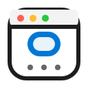

<h1>
  
  Composer Web Extension
</h1>


A powerful Cursor extension that captures live browser content and logs directly into Composer. Perfect for debugging, documentation, and sharing web content with context.

## Features

- 📸 **Smart Capture**: One shortcut to connect and capture everything
- 📊 **Real-time Monitoring**: Console logs and network requests
- 🔍 **Log Filtering**: Customizable filtering for console logs
- 🎯 **Multi-tab Support**: Select from any open tab in your debugging browser
- ⚡ **Advanced Options**: Additional commands for specific capture needs
- 🎛️ **Keybinding Management**: Customize keybindings directly from the new settings panel.

## How It Works

1. **Connect to a Tab**:

   - Press `Cmd/Ctrl + ;` or click the connect button in the status bar
   - Select your target tab from the list
   - The extension starts monitoring console logs and network requests

2. **Monitor Activity**:

   - The status bar shows which tab is being monitored
   - All console logs and network requests are collected in real-time
   - Logs persist until you clear them or disconnect

3. **Capture State**:
   - Press `Cmd/Ctrl + ;` again or click the capture button
   - The extension captures everything:
     - A full-page screenshot
     - All console logs since connection
     - All network requests since connection
   - Everything is sent directly to Composer

## Quick Start

1. Launch Chrome with remote debugging:

   ```bash
   # macOS
   open -n -a "Google Chrome" --args --remote-debugging-port=9222 --user-data-dir=/tmp/chrome-debug-profile

   # Windows
   "C:\Program Files\Google\Chrome\Application\chrome.exe" --remote-debugging-port=9222 --user-data-dir=%TEMP%\chrome-debug-profile

   # Linux
   google-chrome --remote-debugging-port=9222 --user-data-dir=/tmp/chrome-debug-profile
   ```

2. Press `Cmd/Ctrl + ;` to connect and capture!

## Additional Features

Available through Command Palette (`Cmd/Ctrl + Shift + P`) or keyboard shortcuts:

- Clear logs: `Cmd/Ctrl + Shift + ;`
- Send only logs: `Cmd/Ctrl + '`
- Send only screenshot: `Cmd/Ctrl + Shift + '`

## Usage Tips

1. **Status Bar Indicator**:

   - 🔌 Not Connected: Click to connect to a tab
   - 👁️ Connected: Click to capture current tab state

2. **Best Practices**:
   - Wait for page to load completely
   - Clear logs when starting new session
   - Use fresh Chrome profile for best results
   - Use specific commands when you need just logs or screenshots
   - **Keybinding Panel**: Access the keybinding panel via the Command Palette to manage and customize keybindings.

## Troubleshooting

1. **Can't Connect?**

   - Ensure Chrome is running with debugging flag
   - Check if port 9222 is available
   - Try restarting Chrome

2. **Session Disconnected?**

   - The extension will automatically detect stale sessions and show a notification
   - Click the status bar item to reconnect
   - No need to restart Cursor - just reconnect when prompted

3. **Incomplete Capture?**
   - Wait for all content to load
   - Scroll through the page once
   - Check console for errors

## Requirements

- Cursor (latest version)
- Google Chrome/Chromium
- Node.js ≥ 18.0.0

## Contributing

We welcome contributions from the community! Here's how you can help:

### 🐛 Found a Bug?

- **Ensure the bug hasn't already been reported** by searching our [Issues](../../issues)
- If you can't find an existing issue, [open a new bug report](../../issues/new?template=bug_report.md) using our bug report template

### 💡 Have a Feature Idea?

- Check our [Issues](../../issues) to see if it's already suggested
- If not, [create a feature request](../../issues/new?template=feature_request.md) using our feature request template

### 🛠️ Want to Contribute Code?

1. Read our [Contributing Guide](CONTRIBUTING.md)
2. Fork the repository
3. Create your feature branch
4. Make your changes
5. Open a [Pull Request](../../pulls) using our PR template

For more details, check out our:

- [Code of Conduct](CODE_OF_CONDUCT.md)
- [Contributing Guidelines](CONTRIBUTING.md)

## License

MIT - See LICENSE file for details
